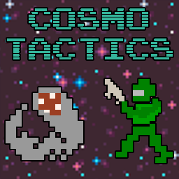

# CosmoTactics



A squad-based tactical roguelike game set in a gritty sci-fi universe. **_Lead your Space Expeditionary Force_** (SEF) squad through hostile alien planets, navigating treacherous environments and battling myriad lifeforms in unique simultaneous turn-based combat.


## 📜 Features

-   **Simultaneous Turn System:** Make every decision count as all units (friendly and hostile) act concurrently after you issue an order to your selected operative.
-   **Squad Command:** Control one unit directly while the rest of your squad operates autonomously based on assigned Stances (Follow/Hold) and Autofire settings.
-   **Dynamic Environments:** Explore procedurally generated maze-like dungeons with varying terrain types and environmental hazards.
-   **Fog of War:** Uncover hidden areas and spot lurking threats using your squad's combined field of view.
-   **Resource Management:** Keep an eye on your squad's oxygen supply and scavenge for valuable gold and supplies.
-   **Diverse Roster:** Encounter various alien enemies and command different SEF Trooper archetypes, each with unique stats and equipment.
-   **Deep Mechanics:** Engage with detailed unit stats, weapon systems, and consumable items.

## 🚀 Getting Started

To run CosmoTactics locally:

1.  **Clone the repository:**

    ```bash
    git clone https://github.com/taislin/cosmotactics.git
    cd CosmoTactics
    ```

    Or you can download it manually or through GitHub Desktop.

2.  **Install Server:**
    This project has no dependencies (the only real dependency is [rot.js](https://ondras.github.io/rot.js/hp/), which is included in a minified version). All you need is a webserver, three options below:

    2.1. You can install Node.js from [the official website](https://nodejs.org/en/download), then run the game on the console:

        `node server.js`

    2.2. If you have Python installed, you can run it with:

        `python -m http.server -b localhost 8125`

    2.3. Download one of the many webserver tools around (they're small executables), and put it on the main directory.

    This will start a server, usually accessible at `http://127.0.0.1:8125/`. Open this URL in your web browser.

## 🎮 How to Play

CosmoTactics is fully playable using either keyboard, mouse, or a combination.

For a comprehensive guide on game mechanics, controls, units, and items, please refer to the **Operator's Manual** (which is also hosted on GitHub Pages):

[**CosmoTactics Operator's Manual**](https://taislin.github.io/cosmotactics/docs/index.html)

## 🛠 Technologies Used

-   **HTML5, CSS3, JavaScript:** Core web technologies.
-   **ROT.js:** Robust roguelike toolkit for display, map generation, FOV, pathfinding, and RNG.

## 🤝 Contributing

Contributions are welcome! If you have suggestions for new features, bug fixes, or improvements to the codebase, please open an issue or submit a pull request.

## 📄 License

This project is licensed under the MIT License - see the `LICENSE` file for details.
